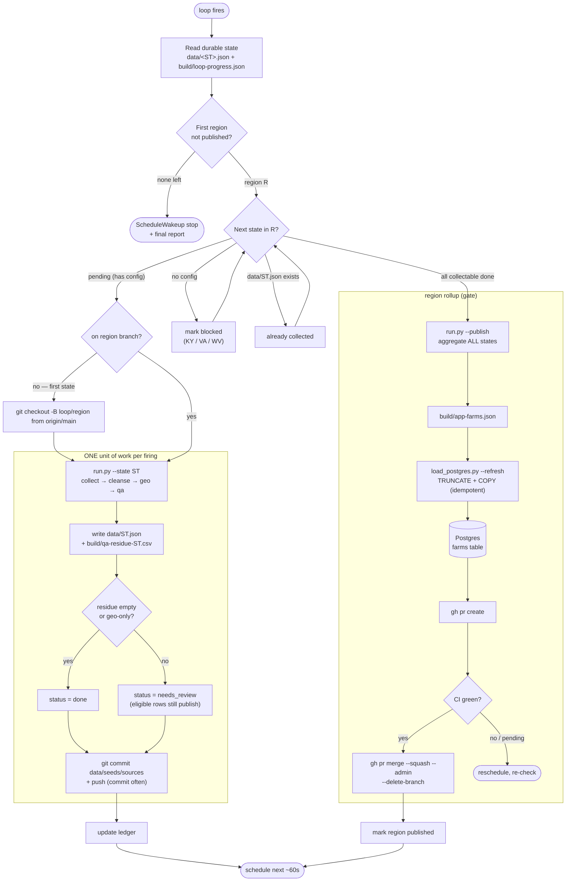

# Loop runbook — collect → validate → load Postgres, region by region

A self-paced loop that walks every region in `regions.json`, runs each state
through the live pipeline (`collect → cleanse → geo → qa`), and — once a region's
collectable states are done — publishes the national feed and full-refreshes a
local **Postgres** database. Southeast first, then southwest, northeast, midwest,
west, non-contiguous.

> This runbook is the first instance of the loop mold in
> [`LOOP-PATTERN.md`](LOOP-PATTERN.md). To build a *new* loop, read the pattern;
> to run *this* one region by region, read on.

**Scope decisions baked in (per the request):**
- **Postgres only, no S3.** The contract-v2 S3 evidence bundle + `promotionReady`
  gate is *not used* here. `state.yaml` release blocks are ignored. The loop's
  source of truth is `data/<ST>.json` + the QA residue + the `farms` table.
- **Zero cost.** Local Postgres (`brew services` `postgresql@14`) and the stdlib
  `psql` client only. Nothing talks to a paid service.
- **"Approval" = the automated QA residue gate.** A state passes when its residue
  is empty or *geography-only* (auto-cleared by `qa.rule_reclear_now_geocoded`).
  Rows still blocked on identity/entity-type review stay ineligible and simply
  don't publish — the eligible rows still load. No human S3 sign-off.
- **Git workflow — one branch + PR per region (the "task").** Branch from `main`
  at the start of each region, **commit every state as it's collected** (commit
  often and regularly), and when the region is published + loaded, open a PR and
  merge it. The next region branches fresh from the updated `main`. Full commands
  in [Git workflow](#git-workflow-per-region) below. The Postgres load is separate
  and local; the PR is how the collected `data/`, `seeds/`, and `sources/` land on
  `main`.
- **Quality bar — every state collects at the same breadth.** A state's coverage
  is its `sources/<region>/<ST>.json` config, and `run.py --state` unions *all* of
  its sources in one firing. Author each config to the pattern the established
  states use: the state's own directory (a live adapter, or a committed `seed`
  when it's a PDF / JS flipbook / login-gated portal) **plus** the national
  directories every state shares — U.S. Farm Trail (`api`), EatWild, PickYourOwn,
  LocalHarvest (`html_table`). All adapters fetch through `httpget` (browser
  User-Agent); without it the national sources answer `403` and a state silently
  under-collects. A single-source config is under-collected, not "done."
  `blocked` means *no config at all* — a thin config is a quality bug to fix.

---

## Architecture



**One firing = one path through the graph:** either it collects a single state
(the `UNIT` box, committing that state) *or* it finalizes a region (the `ROLLUP`
box: publish → load → PR → merge) — never both, never two states. Progress is read
fresh from disk each firing, so a crash just re-runs the current unit harmlessly.

---

## One-time setup (run once before the first loop)

```bash
cd 01-database/pipeline
brew services start postgresql@14      # local server; free. stop later with: brew services stop postgresql@14
python3 load_postgres.py --init        # creates db 'farmfinder' + farms table
```

To target a different database, set `DATABASE_URL` (e.g. `postgres://user@host/db`)
or `FARMFINDER_DB=<name>`; the loader honors both and skips `createdb` when
`DATABASE_URL` is set.

---

## Launch

```
/loop Follow 01-database/pipeline/handoff/LOOP-region-publish.md. Do exactly one unit of work, report, then schedule the next iteration.
```

Omitting an interval runs it dynamic/self-paced. Each firing does **one unit of
work** (collect one state, OR publish+load one region), reports, then schedules
the next wake ~60s out. It is not polling external state — each iteration does
real work synchronously — so a short delay is correct.

---

## Per-iteration algorithm

Work off the filesystem so progress survives across firings; keep a light ledger
at `build/loop-progress.json` for region-published markers and blocked notes.

1. **Load order.** Read `regions.json`; process regions in listed order. Within a
   region, process states in listed order.

2. **Find the frontier.** Pick the **first region not yet marked `published`** in
   the ledger. Within it, classify each state:
   - **blocked** — no `sources/*/<ST>.json` config exists. Cannot collect (e.g.
     every state without an authored config). Record `blocked` with reason "no
     source config"; skip.
   - **collected** — `data/<ST>.json` already exists. Skip.
   - **pending** — has a config, no `data/<ST>.json` yet. This is the work unit.

   **Branch once per region.** If you're not already on this region's branch
   (`git branch --show-current` ≠ `loop/<region>-<date>`), create it from the tip
   of `main` before collecting the region's first state:
   ```bash
   git fetch origin main
   git checkout -B loop/<region>-$(date +%Y%m%d) origin/main
   ```

3. **Collect one pending state** (one per iteration):
   ```bash
   python3 run.py --state <ST>
   ```
   - This writes `data/<ST>.json` and `build/qa-residue-<ST>.csv`.
   - Live-source failures (403 / timeout) are printed as warnings and skipped —
     that is expected and **not** a loop failure; the staged bridge still yields
     rows. Only treat a **non-zero exit / traceback** as a failure: record the
     error in the ledger, mark the state `error`, and move on (do not retry the
     same state more than twice across firings).
   - Read back the printed `eligible N · residue M`. Count the residue that is
     **not** geography-only — those are the rows a human must clear before they can
     publish (mirrors `qa._geography_only`: residue CSV column is `qa_reason`,
     `;`-separated; geography-only ⇒ every part is a geography blocker):
     ```bash
     python3 - "$ST" <<'PY'
     import csv,sys
     st=sys.argv[1]; p=f"build/qa-residue-{st}.csv"
     GEO={"county requires geography review",
          "city or safe public service area requires review"}
     def geo_only(reason):
         parts=[x.strip().lower() for x in reason.split(";") if x.strip()]
         return bool(parts) and all(p in GEO or p.startswith("missing geography") for p in parts)
     n=ng=0
     for r in csv.DictReader(open(p)):
         n+=1
         if not geo_only(r.get("qa_reason","")): ng+=1
     print(f"residue={n} non_geo={ng}")
     PY
     ```
   - Ledger: `states.<ST> = {collected_at, eligible, residue, residue_nongeo,
     status}` where `status = "done"` if `residue_nongeo == 0`, else
     `"needs_review"` (still collected — its eligible rows publish; the flagged
     count is surfaced for a human later).
   - **Commit this state now** (commit often) onto the region branch and push:
     ```bash
     git add 01-database/pipeline/data/<ST>.json \
             01-database/pipeline/seeds/<ST>.json \
             01-database/pipeline/sources/*/<ST>.json 2>/dev/null
     git commit -m "Collect <ST>: <eligible> eligible, <residue_nongeo> to review"
     git push -u origin HEAD
     ```
     Only the state's own artifacts — `build/` and `__pycache__/` are gitignored,
     so nothing generated leaks in. **End the iteration here** and schedule the
     next wake.

4. **Publish + load when the region's collectable states are all done.** If every
   non-blocked state in the current region now has `data/<ST>.json` (status `done`
   or `needs_review`), the region is ready:
   ```bash
   python3 run.py --publish            # aggregate ALL states -> build/app-farms.json
   python3 load_postgres.py --refresh  # full-refresh the farms table (idempotent)
   ```
   - Verify: `psql -d farmfinder -tA -c "SELECT count(*) FROM farms;"` — record the
     row count.
   - Note: `--publish` always rebuilds the whole national feed (committed
     `data/<ST>.json` wins per state; bridge fills the rest), so each region's load
     is a full refresh, not an append — safe and repeatable.
   - **Open the region PR and merge it** (one PR per region — see
     [Git workflow](#git-workflow-per-region) for the full commands and the CI
     gate). In short: commit any rollup artifacts, push, `gh pr create`, wait for
     CI to go green, then `gh pr merge --squash --admin --delete-branch`. If CI is
     still pending, **reschedule and re-check** rather than merging blind; if CI
     **fails**, stop and surface — never merge a red PR.
   - Ledger: `regions.<region> = {published:true, published_at, db_count, pr_url,
     merged:true, blocked_states:[...], review_states:[...]}`. **End the
     iteration.**

5. **Region with only blocked states left.** If the current region has no pending
   and no collectable-but-uncollected states, but still has **blocked** states
   (e.g. southeast's KY/VA/WV), it cannot be *fully* completed autonomously:
   - Still run step 4 to publish + load whatever collected, then mark the region
     `published` with a non-empty `blocked_states` list and a `partial:true` flag.
   - Continue to the next region. Do **not** stall the whole loop on states that
     need a source config authored first (that's a separate browser-scrape task —
     see [`stream-b-wire-sources.md`](stream-b-wire-sources.md)).

6. **Stop condition.** When every region is marked `published` and no `pending`
   state remains anywhere, emit the final report and call
   `ScheduleWakeup stop`. The loop is done.

---

## Each iteration, report (one or two lines)

- Collected a state: `SE ▸ collected AL — 807 eligible, residue 12 (0 non-geo) → done`
- Published a region: `SE ▸ published — 9/12 states, 3 blocked (KY,VA,WV), farms=10,412`
- Blocked/skipped: `SE ▸ KY blocked — no source config`

## Final report

Table of every region: states done / needs-review / blocked, and the final
`farms` row count in Postgres. List all **blocked** states (need a source config
authored — the `sources/<region>/<ST>.json` + browser-scrape task) and all
**needs_review** states (have residue that needs human QA before those extra rows
publish). These are the only things left after the loop and are explicitly out of
its zero-cost, no-S3 scope.

---

## Git workflow (per region)

The **region is the task**: one branch, many commits (one per state), one PR, one
merge. Then the next region starts from the updated `main`.

1. **Branch — once, at the region's first state** (step 2):
   ```bash
   git fetch origin main
   git checkout -B loop/<region>-$(date +%Y%m%d) origin/main
   ```
2. **Commit — after every state** (step 3), so work lands continuously:
   ```bash
   git add 01-database/pipeline/data/<ST>.json \
           01-database/pipeline/seeds/<ST>.json \
           01-database/pipeline/sources/*/<ST>.json 2>/dev/null
   git commit -m "Collect <ST>: <eligible> eligible, <review> to review"
   git push -u origin HEAD
   ```
3. **PR + merge — once, at region rollup** (step 4), after publish + Postgres load:
   ```bash
   gh pr create --base main --head loop/<region>-<date> \
     --title "Collect <Region>: <N> states, <total> eligible" \
     --body "Region <Region> via the publish loop. Per-state counts:\n<list>\nfarms table now <db_count> rows."

   # Gate on CI, then merge. Do NOT merge a red or still-pending PR.
   gh pr checks <pr#>            # green -> merge; pending -> reschedule and re-check; failing -> STOP + surface
   gh pr merge <pr#> --squash --delete-branch --admin
   ```
   - **Merge = admin squash-merge.** GitHub does not let an author approve their
     own PR, so there is no self-`--approve` step; `--admin` performs the merge and
     satisfies branch protection. It requires repo-admin rights (the loop runs as
     the repo owner). If `--admin` is refused, stop and surface — do not force it
     another way.
   - **CI gate is a hard stop.** Merge only when `gh pr checks` is all-green. If
     checks are still running, `ScheduleWakeup` a re-check instead of merging. If
     any check fails, stop the loop and report the failing PR — a red merge to
     `main` is exactly what this gate exists to prevent.
   - After a clean merge, the branch is deleted; the next region re-branches from
     the new `main` (step 2), so each region builds on the last.

---

## Guardrails

- Never hand-edit `data/<ST>.json` — only `run.py --state` writes it.
- Never fabricate `state.yaml` release/approval/S3 evidence metadata — the loop
  ignores that gate entirely; don't touch it.
- **Commit per state, one PR + merge per region** (see Git workflow). Stage only
  the state's own `data/`/`seeds/`/`sources/` files — never `git add -A` (it would
  sweep in unrelated working-tree changes). Never merge a red or still-pending PR.
- Don't edit the frozen tooling lane (`model.py`, `cleanse.py`, `geo.py`,
  `privacy.py`, `qa.py`, `collect.py`, `publish.py`) — this loop only *runs* it.
- A state that has **no** authored source config is blocked, full stop — do not
  invent source URLs to make it collectable.
