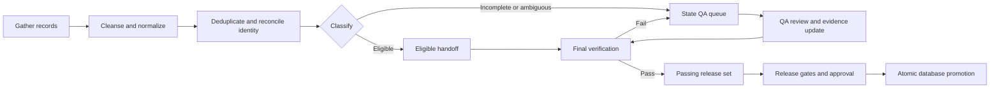

# FarmFinder scalable data pipeline standard

> Effective 2026-07-16 · Applies to every state release and future canonical
> correction release.

## Purpose

FarmFinder scales by separating throughput from final trust decisions. Collection
and cleansing continue state by state, while every candidate follows the same
repeatable path to verification and database promotion.

The governing rule is:

> Eligible records may move forward to verification. Only records that pass final
> verification may enter a promoted database release. Any verification failure
> returns to the originating state's QA queue.

## Standard flow



The loop is intentional. QA is not a dead-end or a reason to stop collecting the
next state; it is the controlled re-entry point for records that need more evidence.

## Stage definitions

### 1. Gather

Collect records using the documented state source passes. Preserve source URLs,
retrieval dates, source text, and immutable observations. A named candidate is
retained even when its fields are incomplete.

### 2. Cleanse and normalize

Normalize names, state, county/parish, city or safe public service area, products,
contacts, websites, and public/private visibility. Missing data creates a blocker;
it does not create an exclusion.

### 3. Deduplicate and reconcile identity

Compare name, geography, address, phone, email, website, source identifiers, and
farm-owned evidence. A name match alone never merges two operations. Keep append-only
decisions and preserve superseded observations.

### 4. Classify into eligible or QA

Rows that meet the staged field, privacy, geography, identity, and evidence rules
are `promotion_eligible_reviewed`. Rows with unresolved blockers are
`research_or_qa_queue` and remain in the state release.

Use the derived handoff command to produce one eligible export per state, one QA
queue per state, and a consolidated QA queue:

```bash
python3 01-database/tools/export_state_pipeline.py
```

The outputs are private derived artifacts under
`data/exports/state-pipeline/`. They do not replace the four-file state contract.

### 5. Final verification

Every eligible record must be checked before promotion. Final verification must
confirm all four areas:

1. **Identity** — this record represents the intended operation.
2. **Farm scope** — the operation qualifies for FarmFinder and is not merely a
   retailer, processor, market, association, school, or other non-farm entity.
3. **Current operating evidence** — current evidence supports that the operation is
   active and the promoted public fields are still valid.
4. **Duplicate handling** — possible matches are resolved, explicitly retained as
   distinct, or merged with append-only evidence-backed decisions.

Verification is a release gate, not a synonym for initial eligibility. A record
that fails any required check returns to its state's QA queue with a specific
blocker and evidence request.

### 6. Passing release set

Records that pass final verification become passing records in a proposed immutable
release. They are not written directly into production one at a time. The release
must retain source provenance, field assertions, verification dates, privacy
classification, checksums, and a rollback path.

### 7. Approval and atomic database promotion

CI/CD may promote the passing release only after the release-level checks pass:

- contract and schema validation;
- source, entity, exclusion, and QA count reconciliation;
- identity and duplicate checks;
- current-evidence and freshness checks;
- privacy and public-projection checks;
- immutable evidence storage and checksum verification;
- approval bound to the current release fingerprint;
- database migration/import verification and rollback readiness.

Promotion advances the database release pointer atomically. It must never partially
publish a state or bypass the current canonical boundary.

## Automation boundary

CI/CD is responsible for orchestrating the loop and enforcing deterministic rules:

- run collectors and normalizers;
- build eligible and QA queues;
- execute identity, geography, freshness, privacy, and duplicate checks;
- route verification failures back to state QA;
- build immutable release artifacts;
- run tests and reconciliation checks;
- require human approval for ambiguous evidence and release promotion;
- promote the validated release atomically and retain rollback metadata.

Automation does not invent evidence. Ambiguous identity, farm scope, operating
status, or duplicate cases remain human-reviewable QA work until sufficient evidence
is recorded.

## Status language

| Status | Meaning | Can move to next state? | Can enter canonical database? |
|---|---|---:|---:|
| `research_or_qa_queue` | Retained candidate with unresolved blocker | Yes, as QA backlog | No |
| `promotion_eligible_reviewed` | Passed cleansing and staged field/evidence gates | Yes, to final verification | No, not by itself |
| `eligible_staged` | Derived handoff created for downstream verification | Yes | No |
| `verified_passing` | Final identity, farm scope, current evidence, and duplicate checks passed | Yes, to release approval | Only through approved release |
| `approved` | Release-level approval and immutable evidence gates passed | N/A | Ready for atomic promotion |
| `promoted` | Release pointer moved atomically | N/A | Yes |

`record_verified` remains the canon-level state for a release whose retained QA
count is zero. Eligible staging must never be reported as record verification,
approval, or canonical promotion.

## Operational outcome

This standard lets the organization collect and cleanse the next state while a QA
engineer works the accumulated queues. It keeps throughput high without lowering
the verification standard that makes the database trustworthy.

Related contracts and tooling:

- [National state release contract](state-release-contract.md)
- [State expansion and verification system](state-expansion-and-verification.md)
- [`export_state_pipeline.py`](tools/export_state_pipeline.py)
- [Source-of-truth workflow](../03-app/site/docs/data-governance/source-of-truth.md)
