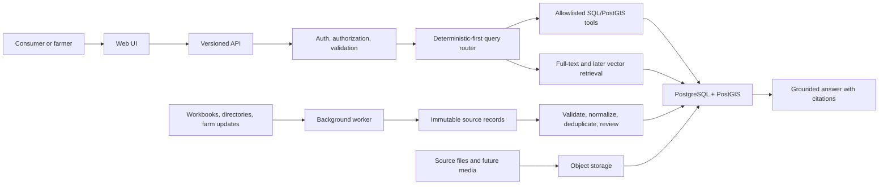

# FarmFinder production architecture

FarmFinder will be a modular monolith with three deployable applications and shared packages. PostgreSQL/PostGIS is the canonical operational database after cutover. Object storage holds immutable source files and future media. RAG is one query path for narrative content, not the system architecture.

## Responsibilities

- `apps/`: things that run and deploy: web, API, worker.
- `packages/`: shared code: database, contracts, query tools, authorization, observability.
- `evals/`: versioned expectations and regression suites. They test runtime guardrails but do not replace them.
- `infra/`: local and deployed PostgreSQL, object storage bindings, queues, secrets contracts, telemetry, backups, and IaC.

## Initial non-functional targets

- Public directory reads remain available without authentication.
- No language model receives database credentials or arbitrary SQL capability.
- Exact counts come from structured queries, not model estimates.
- Every promoted farm value is traceable to a source assertion or curator action.
- Import jobs are idempotent and safe to retry.
- Private contact details and non-public exact locations never enter public API responses or logs.
- Indexes are added from an observed or planned query shape and reviewed after production query statistics exist.

See the [implementation ledger](../implementation-ledger.md), [platform ADR](decisions/0001-platform-foundation.md), [index register](index-register.md), and [source-of-truth workflow](../data-governance/source-of-truth.md).
