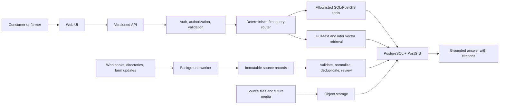

# FarmFinder production architecture

FarmFinder will be a modular monolith with three deployable applications and shared packages. PostgreSQL/PostGIS is the canonical operational database after cutover. Object storage holds immutable source files and future media. RAG is one query path for narrative content, not the system architecture.

## Responsibilities

- `apps/`: things that run and deploy: web, API, worker.
- `packages/`: shared code: database, contracts, query tools, authorization, observability.
- `evals/`: versioned expectations and regression suites. They test runtime guardrails but do not replace them.
- `infra/`: local and deployed PostgreSQL, object storage bindings, queues, secrets contracts, telemetry, backups, and IaC.

## FarmFinder–Sproutflow data boundary

FarmFinder remains the governed fact layer. It retains source-backed farm identity, geography, products, market participation, links, public/private contact classification, and verification history. Those facts remain available to authorized internal queries, including private filtering for farms that may need stronger websites or digital presence.

Sproutflow's commercial workflow is a separate domain. Lead scores, inferred opportunities, outreach attempts, private relationship notes, follow-up dates, proposals, client status, and do-not-contact state are not FarmFinder application data and must never appear in the public FarmFinder API.

The planned initial implementation may use the same PostgreSQL service for operational simplicity, but it must use separate ownership and grants—for example, a governed FarmFinder schema and an owner-only Sproutflow schema joined by immutable `farm_id`. The public API database role receives no grants on Sproutflow-private relations. Background jobs, exports, traces, logs, and analytics must preserve the same boundary. This lets Sproutflow move to a dedicated CRM or service later without changing FarmFinder identities.

This permission boundary is planned, not implemented in the current migrations. It must be proven with deny-by-default integration tests before private outreach data is stored in PostgreSQL.

## Initial non-functional targets

- Public directory reads remain available without authentication.
- No language model receives database credentials or arbitrary SQL capability.
- Exact counts come from structured queries, not model estimates.
- Every promoted farm value is traceable to a source assertion or curator action.
- Import jobs are idempotent and safe to retry.
- Private contact details and non-public exact locations never enter public API responses or logs.
- Sproutflow lead, outreach, and client records are inaccessible to every public FarmFinder role.
- Indexes are added from an observed or planned query shape and reviewed after production query statistics exist.

See the [implementation ledger](../implementation-ledger.md), [platform ADR](decisions/0001-platform-foundation.md), [index register](index-register.md), and [source-of-truth workflow](../data-governance/source-of-truth.md).
