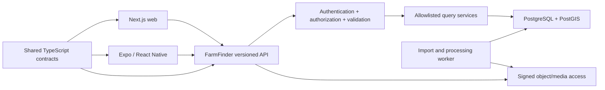
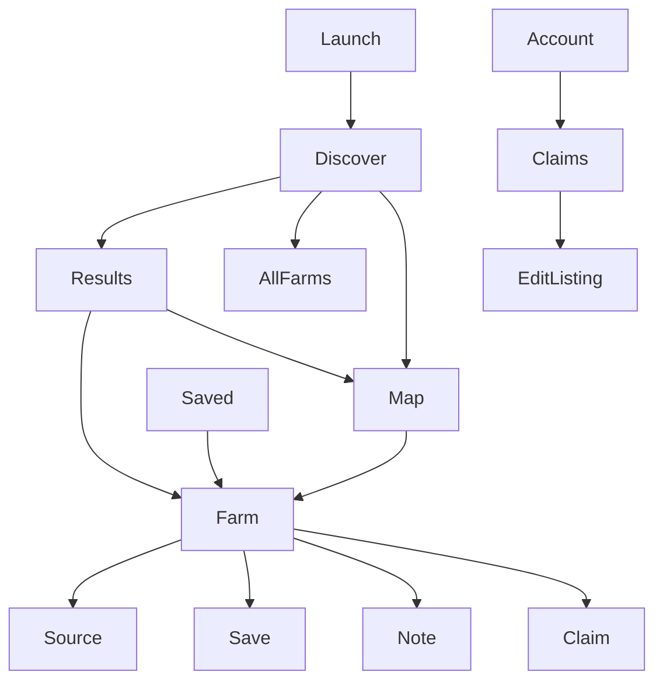

# FarmFinder mobile architecture and wireframes

## Recommendation

Build the native mobile client with **React Native using Expo**, after the read-only API and web authentication contracts are stable.

Expo is the best current fit because FarmFinder already uses TypeScript and React, the team can share API types, validation schemas, design tokens, analytics vocabulary, and authorization policy tests, and managed native builds reduce early iOS/Android operational cost.

React Native is the underlying native UI runtime; Expo is the recommended React Native framework around it. This is not a shortcut or WebView decision. React Native's current first-party guidance recommends using a framework for new applications and identifies Expo as the recommended community framework. Expo's current default TypeScript template includes Expo Router, and Expo Router supplies typed file-based routes, automatic deep links, native stacks, and lazy route evaluation.

Do not wrap the website in a WebView. A responsive/PWA website should remain available, but a store-distributed mobile app should earn its existence through native map interaction, saved farms, deep links, camera/location-assisted corrections, push notifications if users request them, and an intentional offline cache.

## Options considered

| Option | Strength | Cost/risk | Decision |
|---|---|---|---|
| Expo + React Native | TypeScript/React fit, shared contracts/tokens, rapid device builds, strong auth/deep-link ecosystem | Native map/offline behavior still needs device testing | Recommended |
| Bare React Native | Maximum native control | More build/configuration burden before it is justified | Revisit only for unsupported native capability |
| Flutter | Consistent rendering and good mobile performance | New Dart stack, less sharing with Next.js, duplicate contracts/tooling | Not selected |
| Swift + Kotlin | Best platform-specific control | Two teams/codebases and highest maintenance cost | Only if usage proves a platform-specific need |
| Capacitor/WebView | Maximum web reuse | Weaker map, accessibility, navigation, and native feel | Not selected for the flagship app |
| PWA only | Lowest cost and immediate reach | Limited store presence and native background capabilities | Keep as web complement, not native replacement |

## Product boundary

The mobile app is another client of the continental-U.S. FarmFinder product. Louisiana and Mississippi are its first available coverage, not its permanent geography. It does not connect directly to PostgreSQL or object storage.



## Monorepo target

```text
03-app/site/
├── apps/
│   ├── web/                    Next.js App Router
│   ├── api/                    Versioned API service
│   ├── worker/                 Imports and background jobs
│   └── mobile/                 Expo Router application
├── packages/
│   ├── contracts/              Requests, responses, errors, pagination
│   ├── auth-policy/            Role and farm-scope decisions
│   ├── design-tokens/          Semantic color/type/spacing values
│   ├── telemetry/              Event and trace vocabulary
│   └── test-fixtures/          Sanitized contract fixtures
```

Share contracts and semantic tokens, not rendered components. DOM components, CSS, React Native primitives, map implementations, navigation, and accessibility behavior remain platform-specific.

## Mobile navigation

Use Expo Router with native stacks and four primary tabs:

1. **Discover:** search, location-aware nearby farms, radius control, and recent farms.
2. **Map:** full-screen map, clustered results, result sheet, location control, and list toggle.
3. **All farms:** scalable directory search, filters, sort, and paginated results.
4. **Saved:** authenticated synchronized favorites and private notes.

Account, filters, notes, claims, corrections, settings, provenance, and source details live in stack routes rather than permanent tabs. The Ask experience is deferred from the staging mobile tab bar.

## Screen map



## Mobile wireframes

### Discover

```text
┌─────────────────────────────┐
│ FARMFINDER            ○ You │
│ Find food closer to home.   │
│                             │
│ [ Food, farm, or town_____ ]│
│ [ Near me ] [ Louisiana ▾ ] │
├─────────────────────────────┤
│ HARVEST NOW                 │
│ [Vegetables 84] [Eggs 52] →│
├─────────────────────────────┤
│ QUICK PATHS                 │
│ Farmers markets             │
│ On-farm pickup              │
│ Order online                │
├─────────────────────────────┤
│ NEARBY / RECENT RECORDS     │
│ Farm name · town · products │
│ Farm name · town · products │
├─────────────────────────────┤
│ Discover   Map   All   Saved│
└─────────────────────────────┘
```

### Results and filters

```text
┌─────────────────────────────┐
│ ←  Eggs near Covington      │
│ [ search__________________ ]│
│ [Product 1][Market][More 2] │
│ 24 farms            Map ↗   │
├─────────────────────────────┤
│ 001 Farm name               │
│ Town · 8 mi                 │
│ eggs · poultry · market     │
│ [Market] [Farm pickup]      │
├─────────────────────────────┤
│ 002 Farm name               │
│ ...                         │
└─────────────────────────────┘
```

Filters open in a native bottom sheet with Apply and Clear actions. Result count updates before Apply only if the API response is fast enough; otherwise use an explicit Apply action to avoid request churn.

### Map

```text
┌─────────────────────────────┐
│ [←] 24 farms  [List] [Near] │
│                             │
│       clustered map         │
│      ○   12   ○       4     │
│            ◎ selected       │
│                             │
│ ┌─────────────────────────┐ │
│ │ FARM NAME               │ │
│ │ Town · approximate      │ │
│ │ eggs · beef · market    │ │
│ │ View farm →             │ │
│ └─────────────────────────┘ │
├─────────────────────────────┤
│ Discover   Map   All   Saved│
└─────────────────────────────┘
```

Use a native bottom sheet for selected records. Preserve map camera state when opening and closing a farm.

### Farm record

```text
┌─────────────────────────────┐
│ ← Farm record       ♡ Save  │
│ FIELD RECORD / VERIFIED     │
│ FARM NAME                   │
│ Town · Parish/County        │
│ Approximate location        │
├─────────────────────────────┤
│ PRODUCTS                    │
│ eggs · beef · vegetables    │
├─────────────────────────────┤
│ HOW TO BUY                  │
│ Market / pickup / website   │
│ [Open website ↗]            │
├─────────────────────────────┤
│ BEFORE YOU GO               │
│ Availability is not live.   │
├─────────────────────────────┤
│ Source · Updated · Correct  │
└─────────────────────────────┘
```

### Ask (deferred from staging mobile tab bar)

```text
┌─────────────────────────────┐
│ ASK THE FIELD GUIDE         │
│ [Who sells crawfish near__ ]│
│ [ Ask → ]                   │
│                             │
│ GROUNDED ANSWER             │
│ 8 directory matches...      │
│ Availability is not live.   │
│                             │
│ [Show 8 farms]              │
│ Sources / limits            │
├─────────────────────────────┤
│ Discover   Map   All   Saved│
└─────────────────────────────┘
```

## Data and offline policy

- TanStack Query or equivalent manages request caching and retries.
- `expo-sqlite` may retain saved farms, recent searches, last-viewed public profiles, and a bounded last map/result set.
- Cached public records show their dataset release and last-updated time.
- Offline data is read-only; claims and corrections remain queued only if encrypted, explicitly visible to the user, and safe to retry.
- The mobile cache is never canonical and clears private account data on sign-out.
- Map tiles are not bulk-downloaded in v1; revisit offline regions after field-user evidence and provider terms review.

## Authentication

- OIDC Authorization Code + PKCE through the system browser.
- Tokens stored only with platform secure storage.
- Short-lived access token plus rotating/revocable refresh session.
- API enforces authorization for every protected operation.
- Deep-link callbacks use an app-owned scheme and verified universal/app links before production.
- Biometric unlock may protect a local session but never replaces server authentication.

## Native capabilities by phase

| Capability | First mobile release? | Notes |
|---|---|---|
| Search, filters, profiles, map | Yes | Core parity with web API |
| Saved farms | Yes | Local first; sync when authenticated |
| Claims and corrections | After auth policy proves on web | Share contracts, build native form |
| Camera attachments | Later | Requires object-upload quarantine and rights workflow |
| Push notifications | Later | Only for explicit saved-farm/claim events |
| Background location | No | Unnecessary privacy and battery cost |
| Full offline map regions | No | Revisit from real field usage and tile licensing |
| Ordering/payments | No | Product decision remains deferred |

## Performance and accessibility gates

- Cold launch target under 2.5 seconds on representative mid-range devices.
- Search input responds immediately; network work is debounced and cancellable.
- Long lists use virtualization and stable item layouts.
- Map screen loads on demand rather than during app launch.
- Touch targets meet platform guidance; Dynamic Type/font scaling is supported.
- VoiceOver and TalkBack labels describe farm, place, selection, and location confidence.
- Reduced motion and high-contrast settings are respected.
- Every loading, empty, offline, permission-denied, and server-error state gives a next action.

## Mobile implementation phases

1. Create shared contracts/tokens packages and API compatibility suite.
2. Scaffold Expo Router app with development, preview, and production profiles.
3. Implement Discover, Results, Farm, and lazy Map against fixtures.
4. Connect read-only API, caching, offline metadata, and deep links.
5. Add OIDC, Saved sync, private notes, account deletion, and session revocation.
6. Add Ask using the same structured/hybrid answer contract as web.
7. Add claims/corrections only after web authorization tests pass.
8. Run device matrix, accessibility, performance, privacy, store metadata, and staged rollout.

## Revisit triggers

- Eject from Expo only when a required native module or performance profile cannot be met with supported development builds.
- Add native-platform modules only behind a TypeScript interface with iOS/Android tests.
- Consider specialized offline maps only after users demonstrate repeated low-connectivity field use.
- Reconsider Flutter/native only if the team, rendering requirements, or device integrations materially change.

## Decision sources

- [React Native: use a framework to build React Native apps](https://reactnative.dev/blog/2024/06/25/use-a-framework-to-build-react-native-apps)
- [React Native: set up your environment](https://reactnative.dev/docs/set-up-your-environment)
- [Expo: create a project](https://docs.expo.dev/get-started/create-a-project/)
- [Expo Router introduction](https://docs.expo.dev/router/introduction/)
- [Expo development workflow and Continuous Native Generation](https://docs.expo.dev/workflow/overview/)
