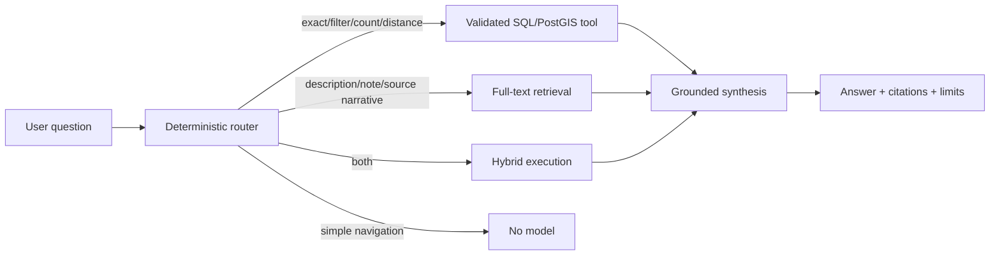

# FarmFinder phased build plan

## Outcome

Build one production-quality FarmFinder platform for continental-U.S. farm discovery in deliberate releases: trustworthy farm data first, a fast public Next.js directory second, governed participation and authentication third, grounded question answering fourth, and a native mobile client only after the shared API is stable.

The website and mobile app are clients of the same FarmFinder platform. PostgreSQL, object storage, source provenance, authorization policy, and API contracts are shared infrastructure; UI state and device-specific interactions are not.

## Product principles

- Public farm discovery never requires an account.
- Structured questions use validated SQL/PostGIS tools; narrative questions use retrieval only when needed.
- No model receives database credentials or arbitrary SQL capability.
- Every displayed farm fact has provenance and a visibility classification.
- Approximate locations are labeled; private exact locations never enter public output.
- The web experience is the first complete client and the contract test for mobile.
- Each phase has a measurable completion gate and a reversible release.
- Louisiana and Mississippi are the launch coverage area; the continental United States is the product boundary.

## What the repository boundaries mean

| Boundary | Meaning in FarmFinder |
|---|---|
| `apps/web` | The public and authenticated Next.js website UI |
| `apps/mobile` | The later Expo/React Native iOS and Android UI |
| `apps/api` | The versioned service boundary used by both UIs and approved tools |
| `apps/worker` | Imports, retries, media processing, release promotion, and scheduled verification |
| `packages/*` | Shared code such as contracts, validation, auth policy, telemetry vocabulary, and design tokens—not a synonym for the database |
| PostgreSQL/PostGIS | Canonical structured facts, provenance, permissions, jobs, full-text search, and spatial queries |
| Object storage | Immutable source workbooks now; governed images and derived variants later |
| Evals | Repeatable examples that measure routing, factual accuracy, citations, refusals, injection resistance, PII handling, latency, and cost; they test guardrails and expectations but do not replace runtime controls |
| Infrastructure | Reproducible definitions and operations for hosting, networks, Postgres, object storage, secrets, identity, queues/workers, telemetry, backups, previews, staging, production, and disaster recovery |

## Source-of-truth workflow for new farms and areas

1. Register the source, terms, retrieval time, area, checksum, and evidence grade.
2. Preserve the raw source object and raw rows immutably under a new release ID.
3. Normalize into staging without overwriting the current canonical release.
4. Reconcile identities using evidence; a name match alone never merges farms.
5. Store field-level assertions so each proposed value points to its source.
6. Run coverage, privacy, duplicate, geography, link, and public-projection gates.
7. Review exceptions and promote the complete release atomically.
8. Move the single current-release pointer only after promotion succeeds; rollback moves that pointer to the prior intact release.

New states follow the same contract. State collection may continue in parallel, but only a governed promoted release is authoritative for the application.

## Index decision discipline

Indexes are production behavior, not decorations. The living decision record is [`../architecture/index-register.md`](../architecture/index-register.md). Every added or removed index must record:

- The exact API query, worker lookup, authorization check, invariant, or ordering it supports.
- Table size, selectivity assumption, equality/range/sort pattern, column order, included columns, predicate, and uniqueness semantics.
- `EXPLAIN (ANALYZE, BUFFERS)` evidence on production-shaped data before adoption and after material growth.
- Read benefit versus insert/update, storage, vacuum, cache, and deployment cost.
- Whether an existing index already covers the access path or makes the proposal redundant.
- Migration behavior, including `CREATE INDEX CONCURRENTLY` or an equivalent low-lock production procedure when required.
- A monitoring and removal trigger based on query latency, scan counts, write amplification, bloat, and actual index usage.

CI verifies the documented index inventory and critical query plans. It does not freeze plans forever: PostgreSQL statistics and data distribution change, so indexes are re-evaluated at release and growth thresholds.

## Phase map

| Phase | State | Product result | Exit gate |
|---|---|---|---|
| 0. Repository and platform foundation | Complete | One private repository, migrations, index register, local PostGIS, object-storage contract, tests | Clean clone reproduces foundation checks |
| 1. Governed PostgreSQL cutover | In progress | Versioned source release, immutable raw rows, reviewed canonical farms | Counts, identity, provenance, privacy, and public-output equivalence pass |
| 2. Next.js web foundation and design system | In progress | Responsive public directory with reusable tokens, components, wireframes, and lazy map | Mobile/desktop QA, accessibility, bundle, lint, build, and smoke gates pass |
| 3. Read-only API and production search | Planned | Versioned browse, search, count, profile, map-bound, and nearby endpoints | Golden queries return exact IDs/counts using documented indexes |
| 4. Authentication, claims, and curation | Planned | Accounts, farm claims, corrections, review queue, audit trail | Deny-by-default integration tests and public-data snapshots pass |
| 5. Grounded question answering | Planned | Deterministic routing between SQL tools, full-text retrieval, hybrid answers, and no-AI paths | Routing, truth, citations, injection, PII, latency, and cost evals pass |
| 6. Production operations and pilot | Planned | CI/CD, staging, telemetry, backups, alerts, five-farm and consumer pilot | Restore, rollback, SLO, support, and outcome evidence exists |
| 7. Mobile foundation | Planned | Stable shared contracts, deep links, session model, offline cache policy, mobile tokens | Web API compatibility suite and mobile architecture review pass |
| 8. Expo/React Native mobile application | Planned | Native discovery, map, profiles, saved farms, claims, and account flows | Store-ready builds, device accessibility, offline/error, and performance gates pass |
| 9. Continental-U.S. expansion | Active data work | Repeatable state releases and county/state coverage reporting | Per-state source passes, freshness, duplicates, licensing, and restore gates pass |

## Phase 1 — PostgreSQL cutover

### Build

1. Keep `2026-07-13-final-v1` immutable and validated in source storage and staging.
2. Review the four duplicate-name groups using location, source, links, contacts, and original records.
3. Normalize states, parishes/counties, cities, products, sales channels, links, contacts, and locations.
4. Create field assertions for every promoted value.
5. Generate the public JSON shape from PostgreSQL and compare it with the current 311-listing artifact.
6. Move the source object and database to managed services with versioning, backups, and restore tests.
7. Promote atomically and change the source-of-truth authority mode.

### Mississippi rule

Continue discovery in `research/ms-expansion/`, but freeze each milestone as a new release ID and checksum. Never overwrite the release currently being reconciled.

## Phase 2 — Next.js web foundation

### Information architecture

1. **Find:** direct search, state/product/way-to-buy filters, synchronized list and map.
2. **Understand:** detailed profiles, location confidence, provenance, products, and buying paths.
3. **Ask:** directory-grounded questions with clear limits and citations when the API arrives.
4. **Participate:** listing correction and claim entry points, enabled only when secure workflows exist.

### Next.js architecture

- App Router with Server Components by default.
- Client Components only for filters, map, dialogs, geolocation, and other browser interactions.
- MapLibre loaded as a lazy client island and excluded from initial-page JavaScript.
- Public directory pages use static generation or cached Server Components after API cutover.
- Search/map state serializes to URL parameters when the API replaces in-memory filtering.
- `loading.tsx`, `error.tsx`, and `not-found.tsx` provide designed non-happy paths.
- Public API access uses Route Handlers or the separate versioned API boundary; mutations use authenticated Server Actions only when they are web-only.

### Web performance budget

- LCP: under 2.5 seconds at p75 on mobile.
- INP: under 200 milliseconds at p75.
- CLS: under 0.1.
- Map code absent from the initial route chunk.
- No full-resolution media without responsive variants and explicit dimensions.
- Public browsing remains usable before map initialization and when map tiles fail.
- Bundle size and Web Vitals are recorded in CI before production promotion.

### Accessibility gate

- WCAG 2.2 AA target.
- Complete keyboard path through search, filters, results, profile dialog, and view switch.
- Visible focus, semantic headings, form labels, live result counts, dialog focus containment, and reduced-motion support.
- Minimum 44px touch targets for primary mobile controls.
- Color never carries category or status meaning alone.

## Phase 3 — API and structured query tools

### Initial API

- `GET /v1/farms/:id`
- `GET /v1/farms`
- `GET /v1/farms/count`
- `GET /v1/farms/nearby`
- `GET /v1/areas/:id/compare`
- `GET /v1/products`
- `GET /v1/dataset-releases/current`

Every endpoint validates bounded parameters, applies a timeout and maximum page size, returns public projections only, and includes stable farm/evidence identifiers.

### Cache policy

- Farm profiles and taxonomies: tagged cache, invalidated after promotion or approved correction.
- Search and map bounds: short shared cache keyed by normalized arguments.
- Account and claim data: private/no shared cache.
- Static shell and public explanatory content: prerendered.

## Phase 4 — Authentication and authorization

### Authentication

- Managed OpenID Connect provider.
- Secure, HTTP-only, same-site sessions on web.
- Authorization Code + PKCE for mobile.
- Server-side session verification on every protected read and mutation.
- Account deletion, session revocation, and audit events included in the first authenticated release.

### Roles

| Role | Access |
|---|---|
| Anonymous | Public farms, public locations, products, markets, and sourced answers |
| Consumer | Anonymous access plus saved farms and preferences |
| Farm owner/manager | Consumer access plus approved farm-scoped listing management |
| Curator | Review claims, assertions, corrections, duplicates, and release candidates |
| Admin | Platform administration; not a bypass for provenance or audit requirements |

Authorization lives in shared policy code and is rechecked inside every Server Action, Route Handler, API endpoint, and worker operation. Proxy/middleware may redirect but is never the sole authorization gate.

## Phase 5 — Question answering

Vector retrieval remains deferred until full-text retrieval fails a documented evaluation set.

## Phase 6 — CI/CD and environments

### Environments

| Environment | Purpose | Data |
|---|---|---|
| Local | Development and destructive testing | Sanitized fixtures plus explicitly staged local releases |
| Preview | Per-pull-request UI/API review | Seeded, non-sensitive test data |
| Staging | Migration, release, restore, and end-to-end validation | Production-shaped governed snapshot |
| Production | Public service | Promoted canonical release only |

### Required CI jobs

1. Dependency and secret scan.
2. Typecheck, lint, unit tests, and Next.js build.
3. Migration apply on clean PostGIS and migration invariant tests.
4. Importer/data-manifest checks when data paths change.
5. API contract and authorization integration tests.
6. Deterministic evals; controlled live-model evals on schedule.
7. Accessibility smoke, responsive screenshots, bundle budget, and Web Vitals checks.
8. Staging deploy and smoke before explicit production promotion.

## Version-control strategy

- `main` is always releasable and protected once CI is connected.
- Use focused branches: `feature/`, `fix/`, `data/`, `infra/`, and `docs/`.
- Require pull requests for application, migration, infrastructure, and authority-mode changes.
- Keep unrelated data collection and application changes in separate commits and pull requests.
- Migrations are forward-only after shared deployment; never edit an applied migration.
- Dataset releases use immutable IDs and checksums. A corrected dataset is a new release, not a force-push over an old file.
- Tag deployable milestones independently: `web-v0.x.y`, `api-v0.x.y`, `mobile-v0.x.y`, and `data-YYYY-MM-DD-N`.
- Use semantic versioning for public API and client releases; use date/revision identifiers for datasets.
- Every pull request records intent, trade-offs, verification, data/privacy effect, index effect, rollout, and rollback.
- Do not commit credentials, database dumps, raw object bytes, private contacts, or production exports.

## Release sequence for the flagship case study

1. `web-v0.1`: fast public directory and design system against pinned JSON.
2. `data-2026-...`: reviewed PostgreSQL canonical release.
3. `api-v0.1`: public read API and structured tools.
4. `web-v0.2`: website reading from API with URL-backed search.
5. `web-v0.3`: authentication, saved farms, claims, and correction review.
6. `web-v0.4`: grounded question answering with evals and request-cost telemetry.
7. `web-v1.0`: measured pilot, production operations, restore evidence, and case study.
8. `mobile-v0.1`: Expo internal build after the web/API contract stabilizes.

## What to revisit as usage grows

- Vector retrieval after narrative-corpus evals.
- A separate queue after PostgreSQL job contention is measured.
- Table partitioning after vacuum, query-plan, backup, or retention evidence.
- Native map/offline specialization after real mobile field usage.
- Independent services only when security, scaling, ownership, or release cadence requires them.

## Implementation snapshot — 2026-07-15

- Added the complete phased plan, web art bible/design system, desktop/mobile web wireframes, and native mobile architecture/wireframes.
- Implemented the Field Journal × Living Atlas visual direction in the current Next.js/Vinext site with Newsreader + Geist tokens, an atlas hero, asymmetric harvest index, responsive navigation, visible focus, and reduced motion.
- Extracted the MapLibre implementation into its own client module and deferred activation until the explorer approaches the viewport.
- Added a local map-loading state and a WebGL failure state that preserves list/search/profile use.
- Verified desktop and Pixel-class responsive screenshots, lint, production build, and rendered HTML/data smoke tests.
- Known performance follow-up: the lazy MapLibre client chunk is approximately 1 MB minified and still triggers the adapter's 500 kB chunk warning. It is no longer needed for the initial hero, but route-level network and execution timing must be measured in CI before the web performance gate can close.
- Authenticated screens, URL-backed server search, production API wiring, CI screenshot automation, and the Expo app remain planned and intentionally wait on their dependency gates.
