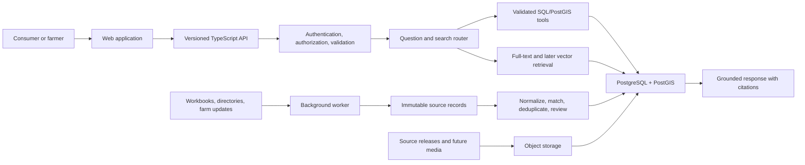

# FarmFinder

FarmFinder is a standalone product building a trustworthy, searchable directory of independent farms and local-food producers across the continental United States. Louisiana and Mississippi are the first coverage area, not the product boundary.

FarmFinder itself has two connected product tracks:

1. **Farm data:** collect, verify, normalize, and maintain farm, product, location, market, contact, and source information.
2. **Consumer application:** help people discover farms, search by product or place, explore a map, and eventually ask grounded natural-language questions.

The database is the shared product asset. Better coverage and farm participation improve consumer discovery, and consumer demand creates more value for participating farms.

> **Geography note:** `LA` means Louisiana throughout this repository, not Los Angeles.

## Project status

FarmFinder currently has a working static-first public directory and a verified production database foundation. PostgreSQL is not yet serving the application; the canonical workbook must first pass through the importer and reconciliation workflow.

| Area | Current state |
|---|---|
| Canonical pre-cutover source | `research/local_farm_database_final.xlsx`, sheet `All Farms` |
| Canonical records | 299 one-row-per-entity workbook listings: 220 LA and 79 MS |
| Public map | 299 mapped listings with explicit location precision |
| Website/contact QA | 88 website flags, 85 populated URLs, 3 missing URLs; 243 direct contacts and 56 missing direct phone/email |
| State expansion | Alabama coverage reviewed: 1,057 observations, 810 retained entities, 799 eligible / 11 QA; all 67 counties reviewed. Texas coverage reviewed: 1,062 observations, 883 retained entities, 716 eligible / 167 QA; all 254 counties reviewed. Both pass the four-file national contract but remain unapproved private staging outside canon. |
| Public application | Working vinext/Next.js directory using generated JSON |
| PostgreSQL cutover | 30-table foundation verified; historical v1 with 315 raw rows remains staged locally; enriched v2 must be staged as a new immutable release |
| Custom indexes | 27 documented indexes tied to queries, invariants, or worker operations |
| Natural-language answers | Prototype client-side parsing only; production hybrid query system is planned |
| Authentication | Schema and hosting helpers exist; farm claim/management flows are not active |
| Object storage | Pinned workbook plus AL/TX state-evidence bundles stored and checksum-verified in local versioned S3-compatible storage; managed bucket and image pipeline pending |
| Repository | Private GitHub repository with one project-level history |

The four former duplicate groups—Butterfield Farm, Earth Friendly Farms, Faust Farms, and River Queen Greens—were evidence-reviewed and consolidated to one canonical row each. Their separate source histories remain in the canonical workbook's provenance fields and `Source Log`.

## What works today

### Public directory

The current application supports:

- Product, farm, town, parish/county, region, and notes search.
- State, farm-category, product, and sales-channel filters.
- A synchronized list and clustered MapLibre map.
- Farm profiles with products, ways to buy, notes, contact information, source provenance, and location confidence.
- Dataset-grounded question parsing for common product, place, season, and farm questions.
- Clear warnings that inventory and availability are not live.
- A public update path for farms and shoppers.

The public application currently reads [`03-app/site/app/data/farms.json`](03-app/site/app/data/farms.json), which is generated from the canonical workbook. This keeps the prototype fast and inexpensive while the production backend is built.

### Data governance

FarmFinder now has explicit rules for:

- Choosing and validating the canonical pre-cutover release.
- Preserving immutable source records and field-level evidence.
- Adding farms without discarding original source text.
- Separating official geography from operational coverage regions.
- Resolving duplicates through evidence and review.
- Classifying exact locations and contacts as public or private.
- Promoting a complete release atomically.
- Running state collection in three documented source passes.
- Performing six-month source and link verification without automatically overwriting canonical data.

Start with:

- [Source-of-truth workflow](03-app/site/docs/data-governance/source-of-truth.md)
- [State expansion and verification system](01-database/state-expansion-and-verification.md)
- [State release contract](01-database/state-release-contract.md)
- [Machine-readable dataset manifest](03-app/site/config/source-of-truth.json)

### PostgreSQL/PostGIS foundation

The production schema covers:

- Dataset releases, import attempts, and immutable raw source records.
- Farms, official administrative areas, coverage regions, and public/private locations.
- Products, aliases, farm-product relationships, and sales channels.
- Markets and farm-to-market relationships.
- Website, store, social, map, contact, and verification data.
- Field-level assertions, confidence, disputes, and canonical selections.
- Users, organizations, memberships, saved farms, and farm claims.
- Full-text documents and chunks for future narrative retrieval.
- Object-storage metadata for source files and future media.
- Retryable jobs, idempotency, outbox events, and audit history.

The database migrations are in [`03-app/site/packages/db/migrations/`](03-app/site/packages/db/migrations/).

## Architecture

FarmFinder is designed as a TypeScript modular monolith with separate deployment units when runtime behavior requires them.



### Deployable applications

`apps/` is for processes that run independently:

- `web`: consumer and farmer UI.
- `api`: REST boundary, authentication, authorization, and query tools.
- `worker`: imports, geocoding, deduplication, retries, document processing, and future media processing.

The current web application remains at `03-app/site/` until it can be moved to `apps/web` without disrupting deployment.

### Shared packages

`packages/` is for code shared by the deployable applications:

- `db`: PostgreSQL schema, migrations, indexes, and database access.
- `contracts`: versioned request/response schemas and OpenAPI types.
- `query-tools`: safe structured queries such as `count_farms`, `search_farms`, and `nearby_farms`.
- `auth`: reusable role and permission rules.
- `observability`: trace propagation, redaction, latency, token, and cost measurements.

Only the database and query-tool boundaries have been started. The other packages will be added with their first real consumer rather than as empty scaffolding.

### Structured questions, retrieval, and RAG

RAG is not the overall system.

- **Structured questions** use validated, parameterized SQL/PostGIS tools. Example: “How many farms in Tangipahoa Parish sell eggs?”
- **Narrative questions** retrieve descriptions, notes, interviews, or source passages and synthesize a cited answer.
- **Mixed questions** run both paths and combine the evidence.
- **Ordinary browsing and filtering** should not call a language model.

A model will never receive arbitrary SQL access or database credentials. It may select an allowlisted tool and propose arguments; the API validates those arguments and runs the query with appropriate authorization.

Full-text retrieval is implemented in the schema. Vector retrieval is deliberately deferred until a useful narrative corpus and evaluation suite demonstrate that full-text search is insufficient.

Read the [architecture overview](03-app/site/docs/architecture/README.md) and [ADR-0001](03-app/site/docs/architecture/decisions/0001-platform-foundation.md) for the trade-off analysis.

## Index policy

Indexes are treated as production decisions, not decorations.

Each custom index records:

- The query or invariant it supports.
- Why its index type and column order were chosen.
- Its write and storage costs.
- How it will be validated in production.
- When it should be removed or reconsidered.

The current design uses:

- B-tree indexes for official identifiers, release reconciliation, filters, and timelines.
- Partial unique indexes for one primary location, one canonical assertion, active claims, and job idempotency.
- PostGIS GiST indexes for public radius, nearest, and map-bound queries.
- Trigram GIN for fuzzy farm-name search and identity review.
- Full-text GIN for narrative document chunks.

Deliberate omissions include generic JSONB indexes, state partitions, and vector indexes. Those will be added only from measured query or retrieval needs.

See the complete [index decision register](03-app/site/docs/architecture/index-register.md).

## Repository layout

```text
farm-finder/
├── 01-database/                 Collection rules, historical workbooks, tools
│   ├── tools/                   Mississippi collection and six-month verification
│   └── state-expansion-and-verification.md
├── 03-app/
│   ├── app-vision.md
│   └── site/                    Current web app and production foundation
│       ├── app/                 UI and current generated farm artifact
│       ├── apps/                Deployable application boundaries
│       ├── config/              Source-of-truth release manifest
│       ├── docs/                Architecture, governance, implementation ledger
│       ├── evals/               Question-routing and safety expectations
│       ├── infra/               Local PostGIS and production infra contract
│       ├── packages/            Database and query-tool packages
│       ├── scripts/             Workbook validation and JSON generation
│       └── tests/               Web smoke tests
├── research/                    Canonical workbook, expansion staging, market research
└── README.md
```

Historical dashboards and older workbooks remain for reference. They are not editable authorities.

## Local development

### Prerequisites

- Node.js `>=22.13.0`
- Python 3
- Docker Desktop for PostgreSQL/PostGIS
- Access to this private repository

### Clone and run the public site

```bash
gh repo clone WBHankins93/farm-finder
cd farm-finder/03-app/site
npm install
npm run data:setup
npm run data:validate
npm run dev
```

`npm run data:setup` creates an ignored `.venv` and installs the pinned workbook dependencies.

### Start and verify PostgreSQL/PostGIS

```bash
cd 03-app/site
cp infra/.env.example infra/.env
npm run db:up
npm run db:verify
npm run db:test
```

The local database binds to `127.0.0.1:54329` by default. The integration suite exercises PostGIS radius search, one-primary-location enforcement, one-canonical-assertion enforcement, and job idempotency inside a transaction that is rolled back.

Stop the container while preserving its volume:

```bash
npm run db:down
```

Delete the local database volume only when an intentional clean rebuild is needed:

```bash
npm run db:reset
```

### Quality checks

Run these from `03-app/site/`:

```bash
npm run data:validate
npm run lint
npm test
npm run db:verify
npm run db:test
```

Current verified baseline:

- Canonical workbook checksum and structure pass.
- 299 canonical rows reconcile to 299 normalized-name entities with no exact normalized-name duplicate groups.
- All 30 FarmFinder tables and 27 documented custom indexes exist.
- Database invariant tests pass.
- The pinned workbook is stored as an immutable versioned object and all 315 raw rows are staged idempotently in PostgreSQL.
- Independent cutover verification reconciles the database count, duplicate groups, object version, and downloaded object checksum.
- The production web build passes.
- FarmFinder server-render and public-artifact smoke tests pass.
- ESLint passes.

## Common data workflows

### Update the current workbook release

Before PostgreSQL cutover, the workbook remains the editable authoring source.

1. Update `research/local_farm_database_final.xlsx`, sheet `All Farms`.
2. Review required fields and duplicate candidates.
3. Update `03-app/site/config/source-of-truth.json` with the new release ID, checksum, row count, entity count, states, and duplicate groups.
4. Run `npm run data:validate`.
5. Regenerate the public JSON with `scripts/generate-farms.py`.
6. Run lint, build, and smoke tests.
7. Run `npm run cutover:stage` and `npm run cutover:verify` so the release is stored and registered before review.
8. During the reversible pre-promotion transition, review and commit the workbook, manifest, artifact, and relevant documentation together.

After PostgreSQL cutover, this process changes: source files become immutable imports, and reviewed canonical tables become the only mutable authority.

### Add a farm

The production workflow will:

1. Register its source and retrieval date.
2. Preserve the raw record before transformation.
3. Normalize names, products, links, contact fields, and geography.
4. Compare identity evidence across name, area, address, contact, links, and source IDs.
5. Send ambiguous candidates to review.
6. Preserve each field assertion and select canonical values without erasing history.
7. Classify location and contact visibility.
8. Promote only as part of a complete, validated release.

### Add a state or collection area

States are the official completeness boundary. Counties and Louisiana parishes are the primary collection units. Foodsheds, metros, agricultural districts, and county clusters are overlays rather than substitutes for official geography.

Every state receives three documented passes:

1. State, extension, and other official sources.
2. Farmers markets, CSAs, food hubs, U-pick, agritourism, and producer associations.
3. National-directory and county-by-county gap discovery.

Mississippi is the next active expansion area. Staging outputs live in `research/ms-expansion/` and do not alter the canonical workbook or the validated cutover release automatically. At a collection milestone, freeze the Mississippi inputs under a new release ID and checksum, upload them as a new immutable object, and stage them without overwriting the current release.

See the [PostgreSQL cutover runbook](03-app/site/docs/data-governance/cutover-runbook.md).

### Six-month verification

From the repository root, after `data:setup`:

```bash
03-app/site/.venv/bin/python 01-database/tools/quarterly_verify.py
```

The scanner validates the pinned release every six months, retries source URLs up to three times, compares previous status, and writes dated exception queues. The historical script filename is retained. It does not delete farms or overwrite canonical values automatically.

## Security and privacy principles

- Public directory reads remain anonymous.
- Authentication is required for saved data, claims, corrections, and administration.
- Authorization is deny-by-default and scoped to the farm or organization being managed.
- Private contacts and non-public exact locations never enter public responses, model prompts, or logs.
- A model cannot issue arbitrary SQL or turn retrieved text into authorization.
- Retrieved webpages, descriptions, and farm notes are treated as untrusted data, never system instructions.
- Import jobs use stable idempotency keys, bounded timeouts, retries, and terminal failure states.
- Object uploads will use short-lived signed operations and quarantine before publication.
- Database migrations use a separate identity from the application.
- Production infrastructure must support encrypted connections, managed secrets, backups, and point-in-time recovery.

## Evaluations and observability

Evals are versioned product expectations, not the runtime guardrails themselves.

The planned evaluation suite covers:

- Structured, narrative, hybrid, and no-AI routing.
- Validated tool arguments.
- Expected farm IDs and exact counts against a pinned dataset release.
- Citation completeness and grounding.
- Prompt injection and unauthorized write attempts.
- Private contact and exact-location disclosure.
- Latency, token use, and estimated cost.

Deterministic database, policy, and routing evals will run on every pull request. A smaller live-model suite will run on a controlled schedule.

OpenTelemetry-compatible traces will connect HTTP requests, authorization, query routing, database calls, retrieval, and model calls. Traces and metrics will record latency, query-tool versions, model/prompt versions, token usage, cost, and citation counts while redacting PII.

See [`03-app/site/evals/`](03-app/site/evals/) and the [implementation ledger](03-app/site/docs/implementation-ledger.md).

## Roadmap

The phases below are dependency-driven guidelines, not calendar promises. Detailed
phase notes are collapsed here; see the [phased build plan](03-app/site/docs/product/phased-build-plan.md)
for the full implementation plan.

| Phase | Status | Guideline |
|---|---|---|
| 0. Foundation | Complete | Establish the repository, architecture, schema, governance, and tests. |
| 1. Data cutover | In progress | Move the validated workbook into an immutable, verified database release. |
| 2. API and search | Planned | Provide versioned APIs and structured farm discovery tools. |
| 3. Claims and curation | Planned | Add authentication, farm claims, corrections, and review workflows. |
| 4. Question answering | Planned | Add grounded structured, narrative, and hybrid answers. |
| 5. Production operations | Planned | Add managed infrastructure, CI/CD, observability, backups, and rollback. |
| 6. Pilot and validation | Planned | Test FarmFinder with farms and consumers and measure real outcomes. |
| 7. Coverage expansion | Active | Repeat the gather → cleanse → QA → verification → promotion loop state by state. |
| 8. Media | Deferred | Add governed farm images and media delivery when the need is demonstrated. |
| 9. Marketplace | Deferred | Consider ordering only after coverage, participation, and demand are proven. |

<details>
<summary>Detailed phase notes</summary>

### Phase 0 — Foundation complete

**Status:** Complete

- Consolidated the project into one private GitHub repository.
- Established the canonical workbook release manifest and validator.
- Documented the architecture, source-of-truth policy, index decisions, and implementation ledger.
- Created and runtime-verified the PostgreSQL/PostGIS schema.
- Added job, idempotency, outbox, audit, auth/claims, full-text, and media-metadata foundations.
- Added database integration tests and updated FarmFinder web smoke tests.
- Documented state expansion, evidence grades, release gates, and six-month verification.

### Phase 1 — Idempotent importer and PostgreSQL cutover

**Status:** In progress

- ✅ Store the pinned workbook as a versioned S3-compatible object and verify its checksum.
- ✅ Register the pinned workbook as a validated `dataset_release`.
- ✅ Import all 315 rows from historical release v1 through an idempotent batch into immutable staging/source records.
- ✅ Keep active Mississippi collection isolated from the pinned release.
- Normalize geography, products, channels, links, and contacts.
- ✅ Reconcile the four known duplicate groups in the canonical workbook using evidence while retaining provenance.
- Stage corrected enriched release v2 as a new immutable release and reconcile its 299 canonical rows.
- Import source provenance and field-level assertions.
- Compare database-derived public JSON against the current artifact.
- Promote the release atomically and make PostgreSQL canonical.

**Completion gate:** counts reconcile from source rows to reviewed entities; no field loses provenance; current public search/map behavior remains equivalent; the previous release is restorable.

### Phase 2 — Versioned API and structured query tools

**Status:** Planned

- Implement the TypeScript API boundary with health, readiness, and OpenAPI contracts.
- Add `get_farm`, `search_farms`, `count_farms`, `nearby_farms`, and `compare_areas`.
- Enforce parameterized SQL, read-only public access, timeouts, result limits, and public-field projections.
- Replace whole-dataset browser delivery with paginated and bounding-box endpoints as coverage grows.
- Keep public pages cacheable and anonymous.

**Completion gate:** golden structured questions return exact expected farm IDs/counts and documented indexes are used by production-shaped query plans.

### Phase 3 — Authentication, farm claims, and curation

**Status:** Planned

- Connect managed OIDC identity.
- Implement consumer, farm-owner, curator, and admin roles.
- Add listing claims, evidence submission, review, corrections, and audit history.
- Separate public, claimed-farm, curator, and private data projections.
- Add saved farms and farmer management views.

**Completion gate:** deny-by-default integration tests pass for every protected action; public snapshots contain no private contacts or exact non-public locations.

### Phase 4 — Hybrid question answering

**Status:** Planned

- Implement deterministic-first routing between structured tools, narrative retrieval, hybrid answers, and no-AI paths.
- Add cited PostgreSQL full-text retrieval over descriptions, notes, interviews, and source material.
- Add prompt-injection controls and PII policies.
- Build dataset-pinned routing, correctness, citation, and refusal evals.
- Add vector retrieval only if full-text retrieval misses documented cases.

**Completion gate:** exact questions never rely on model estimates; material claims include citations; adversarial and PII evals pass; latency and cost stay within defined budgets.

### Phase 5 — Production operations and delivery

**Status:** Planned

- Add CI checks for lint, build, migrations, importer reconciliation, database tests, policy tests, and deterministic evals.
- Provision managed PostgreSQL/PostGIS, private networking, secrets, backups, and point-in-time recovery.
- Add a production migration runner with locking and history.
- Add OpenTelemetry traces, logs, metrics, dashboards, and alerts.
- Test backup restoration into staging.
- Add reproducible IaC after the hosting provider is selected.

**Completion gate:** a clean clone can reproduce all checks; staging deploys automatically; production promotion is explicit; backup restore and rollback are demonstrated.

### Phase 6 — FarmFinder pilot users and flagship case study

**Status:** Planned

- Recompute contactability for FarmFinder listing participation against the 299-listing release.
- Recruit at least five farms for a FarmFinder listing, correction, or claim pilot.
- Recruit a small consumer cohort.
- Measure answer correctness, successful searches, search-to-contact actions, claims, corrections, freshness, latency, and cost.
- Record failures, changed decisions, and operational lessons.
- Publish an architecture diagram and production case study.

**Completion gate:** real users produce measurable behavior and corrections; the case study reports evidence rather than demo-only claims.

### Phase 7 — Coverage expansion

**Status:** Active data work, platform integration planned

- Complete the Mississippi three-pass collection and review its staged candidates.
- Resolve Alabama's remaining QA and evidence-storage gates, then deliberately approve and promote the current release fingerprint; do not fold it into LA/MS canon implicitly.
- Expand state-by-state from the Gulf South until FarmFinder covers the continental United States.
- Track completeness and freshness at state and county/parish levels.
- Maintain operational coverage regions for foodsheds, metros, and agricultural districts.
- Add partitions or database sharding only when query, vacuum, backup, or maintenance measurements require them.

**Completion gate per state:** three passes are logged; every county has a status; candidates reconcile to entities; required fields/privacy pass; exceptions are explicit; previous releases are restorable.

### Phase 8 — Object storage and media

**Status:** Deferred until there is real media

- Store immutable source releases and future farm images outside PostgreSQL.
- Preserve checksums, dimensions, attribution, rights, licenses, variants, visibility, and retention metadata in PostgreSQL.
- Add signed uploads, quarantine, validation, image variants, and CDN delivery.

**Completion gate:** original files are versioned and restorable; unprocessed/private objects are not public; every displayed image has provenance and rights metadata.

### Phase 9 — Marketplace and ordering

**Status:** Intentionally deferred

Ordering, payment, inventory, fulfillment, and marketplace mechanics will not be built until directory coverage, farm participation, and consumer demand are demonstrated. Until then, FarmFinder should link to each farm's chosen ordering or contact method rather than impose a FarmFinder marketplace.

</details>

## FarmFinder product validation

The FarmFinder product sequence is:

```text
database coverage
    → verified listings and farm participation
    → consumer discovery and demand
    → marketplace decision based on evidence
```

Related planning:

- [App vision](03-app/app-vision.md)
- [Phased build plan](03-app/site/docs/product/phased-build-plan.md)
- [Web design system and wireframe](03-app/site/docs/design/web-design-system.md)
- [Mobile architecture and wireframes](03-app/site/docs/mobile/mobile-architecture-and-wireframes.md)
- [Production implementation ledger](03-app/site/docs/implementation-ledger.md)

## Known limitations and open decisions

- The public site still reads generated JSON rather than PostgreSQL.
- The production API and worker do not exist yet.
- PostgreSQL migrations use local initialization hooks; a production migration history/runner is still needed.
- The current question box is not the production hybrid query system.
- Farm claim and curation flows are not active.
- Source licensing and farmer-contributed-data terms must be resolved before broader syndication or app launch.
- The qualifying-farm inclusion rule is documented but will evolve with real edge cases.
- The “~90% without a website” observation applies to the original field-collected South Louisiana cohort, not the entire expanded dataset.
- The frontend build currently emits a non-blocking large-chunk warning that should be addressed before national-scale delivery.
- No public project/data license has been selected; treat repository contents and datasets as private unless explicitly authorized.

## Contributing

This is currently a private project.

When making changes:

1. Create a focused branch from `main`.
2. Keep data release, manifest, generated artifact, and documentation changes aligned.
3. Add migrations rather than editing an applied production schema in place.
4. Document new indexes in both SQL comments and the index register.
5. Preserve source evidence and privacy classifications.
6. Run the relevant data, lint, build, database, and eval checks.
7. Use a pull request that explains the decision, trade-offs, verification, and rollback path.

## Documentation map

- [Production architecture](03-app/site/docs/architecture/README.md)
- [Phased build plan](03-app/site/docs/product/phased-build-plan.md)
- [Web design system and wireframe](03-app/site/docs/design/web-design-system.md)
- [Mobile architecture and wireframes](03-app/site/docs/mobile/mobile-architecture-and-wireframes.md)
- [Architecture decision record](03-app/site/docs/architecture/decisions/0001-platform-foundation.md)
- [Implementation ledger](03-app/site/docs/implementation-ledger.md)
- [Index decision register](03-app/site/docs/architecture/index-register.md)
- [Data governance workflow](03-app/site/docs/data-governance/source-of-truth.md)
- [State expansion and verification](01-database/state-expansion-and-verification.md)
- [Database package](03-app/site/packages/db/README.md)
- [Infrastructure contract](03-app/site/infra/README.md)
- [Evaluation strategy](03-app/site/evals/README.md)
- [Web application README](03-app/site/README.md)
