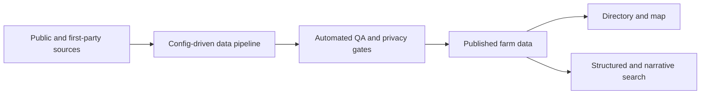

# FarmFinder

FarmFinder is a standalone directory for discovering independent farms and
local-food producers across the United States. It combines two connected
products:

1. A provenance-kept farm database built state by state.
2. A consumer directory, map, and grounded search experience built on that data.

Louisiana and Mississippi are the first coverage area, not the product boundary.
Throughout this repository, **LA means Louisiana**, never Los Angeles.

## On this page

- [What exists today](#current-state)
- [Run the web application](#quick-start)
- [Understand the system](#architecture-at-a-glance)
- [Find your way around](#repository-guide)
- [Choose a task](#task-guide)
- [Read the documentation](#documentation)

<a id="current-state"></a>
## What exists today

| Area | Current state |
|---|---|
| Public application | A working static-first directory and map under `03-app/site/`. |
| Public data | `03-app/site/app/data/farms.json` is the canonical 299-record pre-cutover application dataset. |
| Data pipeline | A config-driven collect → cleanse → QA → publish engine under `01-database/pipeline/`. |
| State expansion | Coverage-reviewed state releases remain read-only staged inputs until the Postgres cutover. |
| PostgreSQL/PostGIS | The production foundation exists, but PostgreSQL does not serve the application yet. |
| Question answering | The app has prototype dataset-grounded parsing; the production hybrid query system is planned. |

Named farm candidates are durable: incomplete data creates a QA reason, not a
silent deletion. Exact private locations and uncleared contact information stay
internal until the publish-time privacy gate approves them.

<a id="quick-start"></a>
## Run the web application

Prerequisites: Node.js `>=22.13.0` and Python 3.

```bash
cd 03-app/site
npm install
npm run data:setup
npm run data:validate
npm run dev
```

For PostgreSQL, all checks, and contribution steps, use the
[development guide](docs/development/README.md#local-web-setup).

<a id="architecture-at-a-glance"></a>
## Architecture at a glance



Today the web application reads a generated JSON artifact. The target platform
promotes approved data into PostgreSQL/PostGIS and exposes it through validated
API and query-tool boundaries. Read the [project architecture](docs/architecture/README.md#system-shape)
for the current and target flows.

<a id="repository-guide"></a>
## Repository guide

```text
farm-finder/
├── 01-database/          Data pipeline, source configs, rules, and legacy release tooling
├── 02-outreach/          Farm and partner outreach planning
├── 03-app/site/          Public web app and production platform foundation
├── docs/                 Project-level architecture and task guides
├── research/             Read-only staged releases and research material
├── AGENTS.md             Required operating rules for repository work
└── README.md             Project entry point
```

The primary implementation authorities are the
[pipeline](01-database/pipeline/README.md#run-the-pipeline) and the
[web application](03-app/site/README.md#quick-start). Generated pipeline output
under `01-database/pipeline/build/` is reproducible and must not be committed.

<a id="task-guide"></a>
## Choose a task

| If you want to… | Start here |
|---|---|
| Understand the sources of truth | [Documentation authority map](docs/README.md#sources-of-truth) |
| Run or test the pipeline | [Data guide: run the pipeline](docs/data/README.md#run-the-pipeline) |
| Add or update a state source config | [Data guide: state source configs](docs/data/README.md#state-source-configs) |
| Implement a source adapter | [Data guide: source adapters](docs/data/README.md#source-adapters) |
| Backfill missing coordinates | [Data guide: geocode backfill](docs/data/README.md#geocode-backfill) |
| Work on the site | [Development guide: local web setup](docs/development/README.md#local-web-setup) |
| Start local PostgreSQL/PostGIS | [Development guide: local database](docs/development/README.md#local-database) |
| Prepare a pull request | [Development guide: contribution workflow](docs/development/README.md#contribution-workflow) |
| Review the roadmap | [Phased build plan](03-app/site/docs/product/phased-build-plan.md#phase-map) |

<a id="documentation"></a>
## Documentation

The [documentation hub](docs/README.md#documentation-by-task) organizes the project
by task and system area. Detailed docs live beside the systems they describe;
the root `docs/` directory provides cross-project orientation without copying
those local instructions.

Before changing anything, read [AGENTS.md](AGENTS.md). It defines scope lanes,
privacy and deletion rules, branch discipline, and the checks required before a
pull request.
