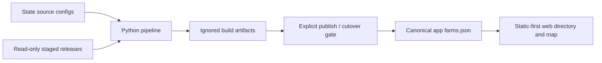
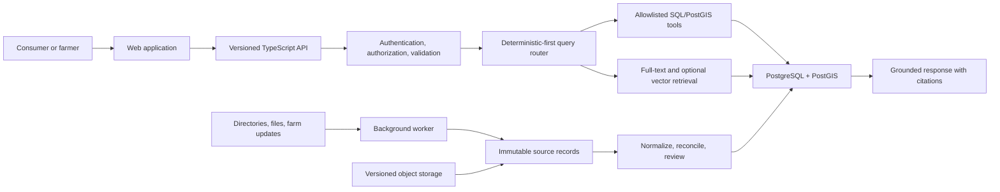
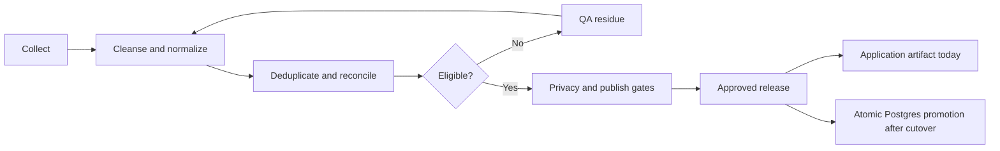

# FarmFinder architecture

FarmFinder is a data-governance platform and a consumer discovery application.
The farm database is the shared asset: source-backed records flow through one
pipeline, and approved public fields support the directory, map, search, and
future grounded answers.

## On this page

- [System shape](#system-shape)
- [Current architecture](#current-architecture)
- [Target architecture](#target-architecture)
- [Data lifecycle](#data-lifecycle)
- [Query architecture](#query-architecture)
- [Deployment boundaries](#deployment-boundaries)
- [Security and privacy](#security-and-privacy)
- [Open platform decisions](#open-platform-decisions)
- [Detailed design documents](#detailed-design-documents)

## System shape

FarmFinder is designed as a TypeScript modular monolith with separately
deployable processes when runtime behavior requires them. The data pipeline is
a Python, standard-library engine organized around a canonical farm model and
per-state configuration.

The architecture has three boundaries:

1. **Collection and governance** preserve provenance, normalize records, resolve
   identity, route residue to QA, and enforce privacy.
2. **Publication and storage** expose only approved public fields through a
   reproducible artifact today and PostgreSQL/PostGIS after cutover.
3. **Discovery** serves ordinary browsing, structured search, and grounded
   narrative questions without giving a model arbitrary database access.

## Current architecture

- The pipeline lives in [`01-database/pipeline/`](../../01-database/pipeline/README.md#layout).
- State behavior is configuration, not state-specific collector code.
- `01-database/pipeline/build/` contains reproducible, ignored output.
- The public app reads [`03-app/site/app/data/farms.json`](../../03-app/site/app/data/farms.json).
- PostgreSQL/PostGIS migrations and tests exist, but the database does not yet
  serve the public application.

The explicit gate between build output and application data prevents a pipeline
run from silently changing the public directory.

## Target architecture

PostgreSQL/PostGIS becomes canonical only after the cutover gates reconcile the
approved release and preserve rollback. Object storage holds immutable source
files and future media; PostgreSQL holds their metadata, relationships, and
reviewed canonical values.

## Data lifecycle

Named candidates do not disappear because fields are missing. The pipeline adds
a `qa_reason`; removal requires affirmative, cited evidence that a record is a
non-farm, closed, outside the jurisdiction, or a duplicate identity.

The [data guide](../data/README.md#authority-boundaries) explains which inputs
are editable during the transition. The detailed stage contracts live in the
[pipeline README](../../01-database/pipeline/README.md#run-the-pipeline).

## Query architecture

RAG is one query path, not the whole system:

| Request | Path |
|---|---|
| Browse, filter, or map farms | Ordinary application/API query; no model needed |
| Exact count, location, or product question | Validated, parameterized SQL/PostGIS tool |
| Narrative question about descriptions or source passages | Full-text retrieval and a cited synthesis |
| Mixed structured and narrative question | Both paths, combined with explicit evidence |

A model may choose an allowlisted tool and propose arguments. The API validates
those arguments and runs the query with the caller's permissions. A model never
receives arbitrary SQL access or database credentials. Vector retrieval remains
deferred until evaluations show that full-text retrieval is insufficient.

## Deployment boundaries

The target modular monolith separates runtime responsibilities without creating
premature services:

- `web`: consumer and farmer user interface.
- `api`: REST boundary, policy enforcement, and query tools.
- `worker`: imports, geocoding, identity reconciliation, retries, and document
  or media processing.
- `packages/db`: schema, migrations, indexes, and database access.
- Future shared packages: contracts, authorization, and observability, added
  only when they have a real consumer.

The current web application remains at `03-app/site/` until it can move without
disrupting deployment.

## Security and privacy

- Public directory reads remain anonymous.
- Authorization is deny-by-default for claims, corrections, and administration.
- Private contacts and non-public exact locations never enter public responses,
  model prompts, or logs.
- Retrieved pages and farm notes are untrusted data, not model instructions.
- Import and worker jobs use stable idempotency keys and bounded retries.
- Migrations use a separate identity from the application in production.
- Every promoted value remains traceable to a source assertion or curator action.

The publish-time policy is implemented in
[`pipeline/privacy.py`](../../01-database/pipeline/privacy.py). Platform details
live in the [production architecture](../../03-app/site/docs/architecture/README.md#initial-non-functional-targets).

## Open platform decisions

- The production API, worker, farm claims, and curation flows are not active.
- PostgreSQL migrations still need a production migration runner and history.
- Source licensing and farmer-contributed-data terms must be resolved before
  broader syndication or launch.
- The qualifying-farm inclusion rule will evolve as verified edge cases appear.
- The web build's non-blocking large-chunk warning should be resolved before
  national-scale delivery.
- No public project or data license has been selected; repository contents and
  datasets remain private unless explicitly authorized.

Track implementation progress in the
[implementation ledger](../../03-app/site/docs/implementation-ledger.md) and
dependency order in the [phased build plan](../../03-app/site/docs/product/phased-build-plan.md#phase-map).

## Detailed design documents

- [Platform foundation ADR](../../03-app/site/docs/architecture/decisions/0001-platform-foundation.md#decision)
- [Production architecture](../../03-app/site/docs/architecture/README.md#responsibilities)
- [Index decision register](../../03-app/site/docs/architecture/index-register.md#review-procedure)
- [Source-of-truth workflow](../../03-app/site/docs/data-governance/source-of-truth.md#authority-modes)
- [PostgreSQL cutover runbook](../../03-app/site/docs/data-governance/cutover-runbook.md#remaining-promotion-gates)
- [Evaluation strategy](../../03-app/site/evals/README.md)
- [Phased build plan](../../03-app/site/docs/product/phased-build-plan.md#phase-map)

Return to the [documentation hub](../README.md#documentation-by-system).
